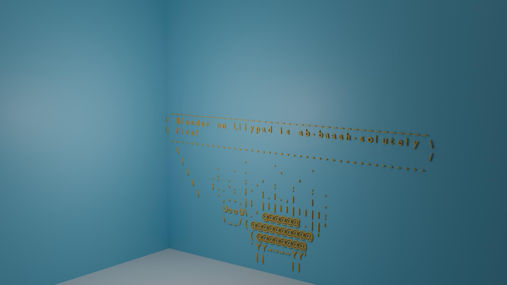

# Lilysay 3D for Lilypad and Docker

## Introduction

Lilysay 3D is a fun demo that combines the power of Blender and the classic Cowsay program to generate 3D renders of ASCII art. The project allows you to create 3D models of various cow files and render them in Blender, providing a unique and entertaining way to visualize text-based art.

There is no pre-generated blender scene in this repository. The scene is generated on the fly by the script. The script uses the Blender Python API to create a 3D scene with the desired cow and message. The scene is then rendered as an image file that can be saved and shared.



## Lilypad

To run Lilysay 3D in Lilypad, you can use the following commands:

Defaults:

```sh
lilypad run github.com/rhochmayr/lilypad-module-lilysay-3d:0.0.3
```

Custom Message and (Cow) Image:

```sh	
lilypad run github.com/rhochmayr/lilypad-module-lilysay-3d:0.0.3 -i Message="Blender on Lilypad is fun!" -i Image="lilycorn"
```

## Docker

### Building and Running the Docker Container

To build and run the Docker container for Lilysay 3D, follow these steps:

1. Clone the repository:
   ```sh
   git clone https://github.com/rhochmayr/lilypad-module-lilysay-3d.git
   cd lilypad-module-lilysay-3d
   ```

2. Build the Docker image:
   ```sh
   docker build -t lilysay3d .
   ```

3. Run the Docker container:
   ```sh
   docker run --rm -v $(pwd)/outputs:/outputs lilysay3d <cow_type> <message>
   ```

   Replace `<cow_type>` with the desired cow file (e.g., `tux`, `dragon`, `lilycorn`) and `<message>` with the text you want to display.

### Usage Instructions

The `lilysay3d.py` script is the main script that generates 3D renders of ASCII art using Blender. Here are the usage instructions:

1. Ensure you have Blender installed on your system.

2. Run the script with the desired cow type and message:
   ```sh
   blender --background --python lilysay3d.py -- <cow_type> <message>
   ```

   Replace `<cow_type>` with the desired cow file (e.g., `tux`, `dragon`, `lilycorn`) and `<message>` with the text you want to display.

3. The rendered image will be saved in the `outputs` directory.

## Custom Cow Files

The repository includes several custom cow files located in the `custom-cows` directory. These cow files can be used to generate unique 3D renders. Here is a list of the available custom cow files and their purposes:

- `bud-frogs.cow`: The Budweiser frogs
- `lilycorn.cow`: Lilysay demo with Unicorn
- `lilyduck.cow`: Lilysay demo with Duck on a Lilypad
- `lilyfrog.cow`: Lilysay demo with Frog
- `lilypad.cow`: Lilysay demo with a Lilypad
- `lilyrocket.cow`: Lilysay demo with Moon and thoughts

You can use these custom cow files by specifying their names as the `<cow_type>` argument when running the Docker container or the `lilysay3d.py` script.

Credits for the custom cow files go to https://github.com/Lilypad-Tech/lilypad-module-lilysay

## Default Cow Files

In addition to the custom cow files, Lilysay 3D also includes the classic Cowsay cow files for generating 3D renders that are part of the python-cowsay package.

Here is a list of the available default cow files:
https://github.com/James-Ansley/cowsay/tree/main/src/cowsay/cows

## Dependencies and Credits

- Blender: https://www.blender.org/
- Cowsay: https://pypi.org/project/python-cowsay/
- Lilysay: https://github.com/Lilypad-Tech/lilypad-module-lilysay