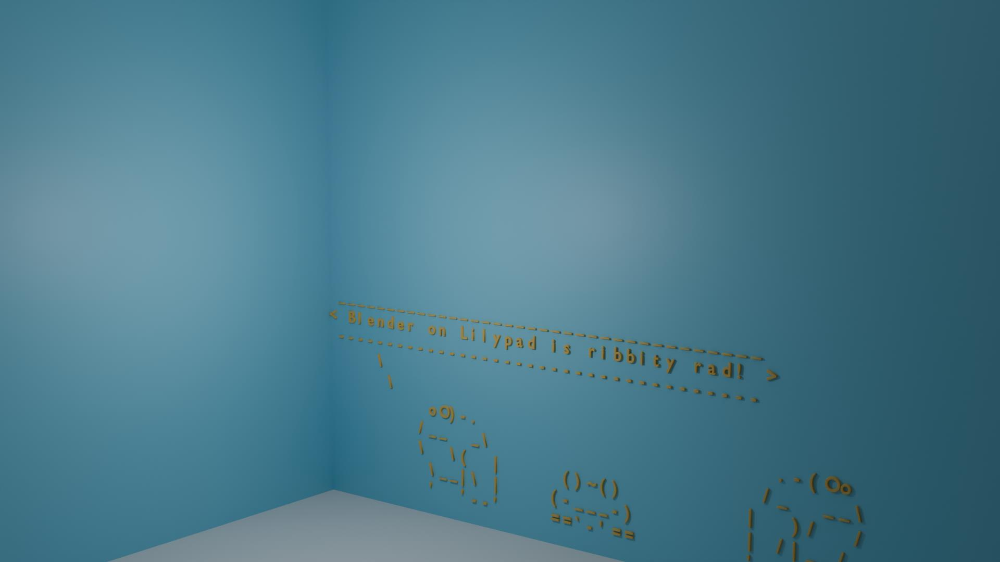
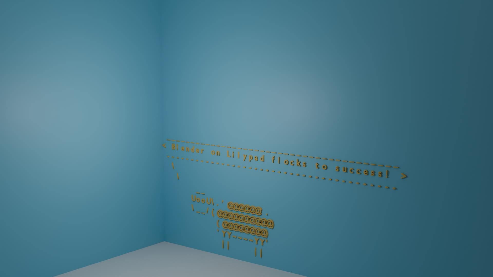

# LILYSAY-3D Examples

This page contains examples of different image and message variations.

## Examples

| Image | Message | Result |
| --- | --- | --- |
| lilypad | Blender on Lilypad sits in its natural habitat! |  |
| lilyduck | Blender on Lilypad quacks up the competition! |  |
| blowfish | Blender on Lilypad puffs up the competition! |  |
| bud-frogs | Blender on Lilypad is ribbity rad! |  |
| dragon | Blender on Lilypad breathes fiery inspiration! |  |
| eyes | Blender on Lilypad has its eyes on greatness! |  |
| flaming-sheep | Blender on Lilypad sets the herd on fire! |  |
| lilycorn | Blender on Lilypad sparkles with unicorn magic! |  |
| lilyrocket | Blender on Lilypad launches to new heights! |  |
| moose | Blender on Lilypad is a-moose-ing! |  |
| satanic | Blender on Lilypad summons creative demons! |  |
| sheep | Blender on Lilypad flocks to success! |  |
| surgery | Blender on Lilypad operates with precision! |  |